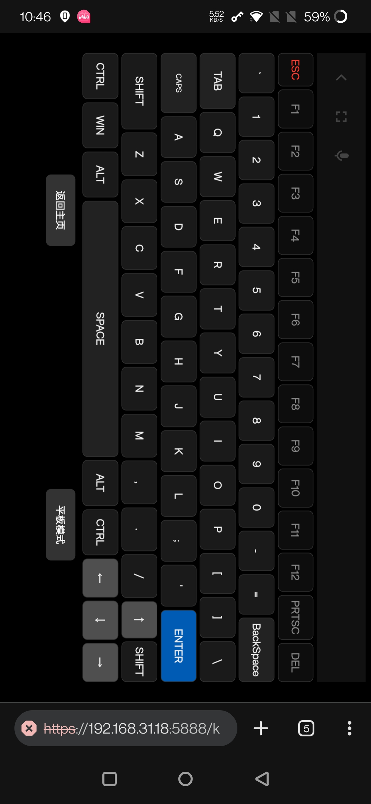
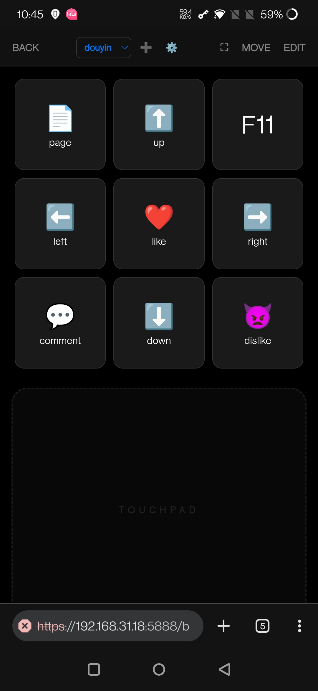

# Remote Touchpad & Keyboard
内部代号：feishu（飞鼠）

这是一个基于 Python 后端的轻量级远程控制工具，可将移动设备（Android/iOS）转化为电脑的：触控板、键盘、语音输入工具、宏按键面板。

<table style="border: none;">
  <tr style="border: none;">
    <td style="border: none;">
      
    </td>
    <td style="border: none;">
      
    </td>
    <td style="border: none;">
      
    </td>
    <td style="border: none;">
      
    </td>
  </tr>
</table>

## 🌟 项目亮点

### 1. 简单启动
python一键启动，无需安装手机客户端。

### 2. 触控操作

* **单指**：移动 / 左键单击。
* **双指**：滚动 / 右键单击。
* **三指**：拖拽 / 中键单击。
* **gyro**：陀螺仪飞鼠

并且有提供鼠标前进、后退、中键、上下滚轮的按钮。


## 🛠️ 要求

* **Python 3.x**

## 🚀 快速启动

 **安装依赖**：
```bash
pip install -r requirements.txt
```


 **运行服务端**：
```bash
python server.py
```


 **连接**：
确保手机与电脑在同一局域网，访问电脑 IP 的端口（默认 5888）。

例如： http://192.168.31.18:5888/ 

注意，浏览器会提示网页不安全，需要手工点进去信任，因为我们用的是自签的证书
> CHROME 浏览器安全限制，只有https网页才能传输陀螺仪数据。

---

## 📂 项目结构

* `server.py`: Python 后端逻辑，处理 Socket 信号并调用系统接口。
* `templates/index.html`: 触控板页面。
* `templates/keyboard.html`: 键盘输入页面。
* `templates/voice.html`: 语音输入页面。
* `macro.html`: 宏按键页面。
* `macro_config.json`: 宏按键配置文件。
---

## 🔧 调优说明
- 建议使用安卓手机+chrome浏览器。
- 虽然 ios  safari 浏览器也可以正常使用，但是鼠标的移动会变得卡卡的。

# macos相关
使用mac版本需要线修改一些py代码，才能正常使用。
```py
# 删除printscreen键

SPECIAL_KEYS = {
    'ctrl': Key.ctrl, 'ctrl_r': Key.ctrl_r,
    'shift': Key.shift, 'shift_r': Key.shift_r,
    'alt': Key.alt, 'alt_r': Key.alt_r,
    'win': Key.cmd, 'command': Key.cmd, 'meta': Key.cmd,
    'enter': Key.enter, 'esc': Key.esc, 'tab': Key.tab, 'backspace': Key.backspace,
    'space': Key.space, 'delete': Key.delete,
    'up': Key.up, 'down': Key.down, 'left': Key.left, 'right': Key.right,
    'f1': Key.f1, 'f2': Key.f2, 'f3': Key.f3, 'f4': Key.f4, 'f5': Key.f5, 'f6': Key.f6,
    'f7': Key.f7, 'f8': Key.f8, 'f9': Key.f9, 'f10': Key.f10, 'f11': Key.f11, 'f12': Key.f12
}

# 修改滚动方向,它滚动方向和 Windows 是反过来的
@socketio.on('scroll')
def handle_scroll(data):
    # 处理双指滑动或按钮连发发来的滚动信号
    mouse.scroll(0, -data['dy']) 
```

    
## 更新日志
2026-01-23 Day3
- [x]  两个手指快速抬起导致识别成鼠标跳转修复
- [x]  “单指长按拖拽”功能
- [x]  将触控板逻辑提取为独立模块 `touchpad.js`，实现多页面同步更新


2026-01-21 Day2
- [x]  点击返回时强制清除所有长按功能，以防止影响触控
- [x]  飞鼠增加一些微小动作滤除，防手抖

- [x]  键盘上下左右 无效 另外位置也不舒服
- [x]  键盘del 按钮位置不对 应该在F12右边
- [x]  缺少printscreen 按钮
- [x]  缺少反斜杠按钮（在括号右边）

- [x]  输入条太小并不能实时语音上屏（之前让他实时上屏存在一点问题）
- [x]  或许我可以再搞个独立页面专门用来语音上屏,并且可以切换实时上屏和输入框模式
- [x]  记住gyro模式，如果之前是开启那么回到页面自动开启
- [x]  键盘模式默认就横过来展示，无视手机的方向（如果检测到是手机）
  
2026-01-21 Day1
- [x]  实现整体基础架构
- [x]  实现飞鼠功能还有鼠标控制功能以及三指拖动功能等
- [x]  实现键盘功能
