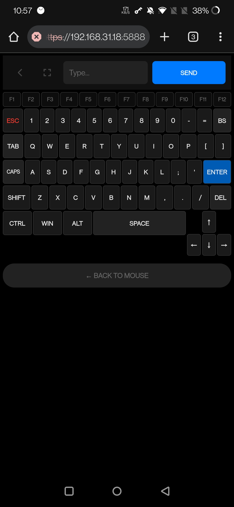
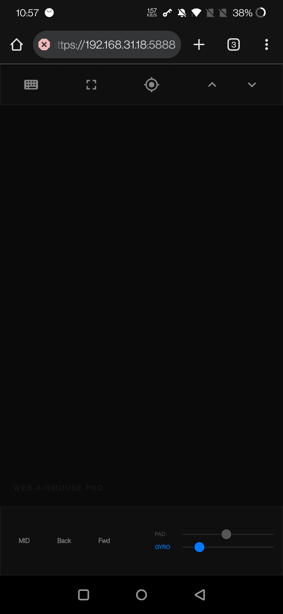
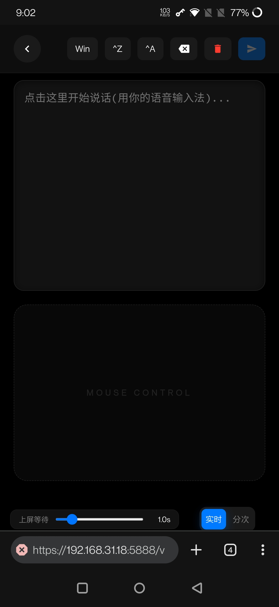

# Remote Touchpad & Keyboard
内部代号：feishu（飞鼠）

这是一个基于 Python 后端的轻量级远程控制工具，可将移动设备（Android/iOS）转化为电脑的**无线触控板**与**多功能键盘**。

<table style="border: none;">
  <tr style="border: none;">
    <td style="border: none;">
      
    </td>
    <td style="border: none;">
      
    </td>
    <td style="border: none;">
      
    </td>
  </tr>
</table>

## 🌟 项目亮点

### 1. 简单启动
python一键启动 无需安装

### 2. 全键盘
键盘输入提供完整的全键盘、并且支持组合键输入。
（当按键长按变黄之后，再点击一下就恢复默认了）

### 3. 触控操作

* 保留了最稳健的第一版触控逻辑：
* **单指**：移动 / 左键单击。
* **双指**：滚动 / 右键单击。
* **三指**：拖拽。
并且有提供鼠标前进、后退、中键的按钮（中键是相当常用的我想不通为啥大部分远程控制软件都不提供这个）

### 4. gyro
陀螺仪飞鼠，试一下就知道咋回事拉！
点击触控板顶部的瞄准按钮开启。

### 

---

## 🛠️ 要求

* **Python 3.x**
* **依赖库**：好几个依赖。

---

## 🚀 快速启动

 **安装依赖**：
```bash
pip install -r requirements.txt
```


 **运行服务端**：
```bash
python server.py
```


 **连接**：
确保手机与电脑在同一局域网，访问电脑 IP 的端口（默认 5888）。

例如： http://192.168.31.18:5888/ 

注意，可能会提示网页不安全，需要手工点进去信任，因为我们用的是自签的证书。

---

## 📂 项目结构

* `server.py`: Python 后端逻辑，处理 Socket 信号并调用系统接口。
* `templates/index.html`: 触控板页面（包含灵敏度持久化与横屏适配）。
* `templates/keyboard.html`: 键盘输入页面（包含防挤压布局与全屏控制）。
* `templates/voice.html`: 语音输入页面（包含横屏适配）。

---

## 🔧 调优说明
- 建议使用安卓手机+chrome浏览器。
- 经过我的测试，虽然 ios  safari 浏览器也可以正常使用，但是鼠标的移动会变得有些卡卡的。
- 如果你是macos，建议修改一下server.python，修改一下滚动方向，它和 Windows 是反过来的

```bash
@socketio.on('scroll')
def handle_scroll(data):
    # 处理双指滑动或按钮连发发来的滚动信号
    mouse.scroll(0, -data['dy']) # 这里改成 -data['dy'] 就可以了
```

## 更新日志

2026-01-21 Day2
- [x]  点击返回时强制清除所有长按功能，以防止影响触控
- [x]  飞鼠增加一些微小动作滤除，防手抖

- [x]  键盘上下左右 无效 另外位置也不舒服
- [x]  键盘del 按钮位置不对 应该在F12右边
- [x]  缺少printscreen 按钮
- [x]  缺少反斜杠按钮（在括号右边）

- [x]  输入条太小并不能实时语音上屏（之前让他实时上屏存在一点问题）
- [x]  或许我可以再搞个独立页面专门用来语音上屏,并且可以切换实时上屏和输入框模式

2026-01-21 Day1
- [x]  实现整体基础架构
- [x]  实现飞鼠功能还有鼠标控制功能以及三指拖动功能等
- [x]  实现键盘功能
